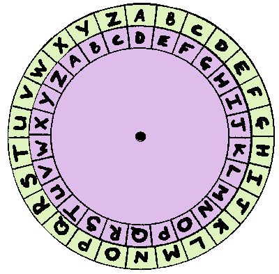

# <p align="center">GOOD CODE</p>

In this file I try to save good code I acquire throughout my journey

## Rock paper scissors the smart way, Python:

```python
def rps(p1, p2):
    beats = {'rock': 'scissors', 'scissors': 'paper', 'paper': 'rock'}
    if beats[p1] == p2:
        return "Player 1 won!"
    if beats[p2] == p1:
        return "Player 2 won!"
    return "Draw!"
```
## Rot 13:
Rot13 is a simple letter substitution cipher that replaces each letter with the letter 13 positions ahead of it in the alphabet. In other words, it's a Caesar cipher with a shift of 13. For example, the letter "a" becomes "n", "b" becomes "o", and so on. This means that if you have a message that uses only letters, you can easily decode it by shifting each letter back 13 positions.

<center>
  
</center>

```python
import string
def rot13(message):
    lc = string.ascii_lowercase #lc stands for "lowercase characters"
    uc = string.ascii_uppercase #uc stands for "uppercase characters"
    res = ""
    for c in message: #Looping through the given string
        if c in lc:
            res += lc[(lc.index(c) + 13) % 26] #Adding the 13th letter ahead of c to the result variable, if c is lowercase.
        elif c in uc:
            res += uc[(uc.index(c) + 13) % 26] #Adding the 13th letter ahead of c to the result variable, if c is uppercase.
        else:
            res += c #If c is not in lc nor uc it will be added to the result with no modification
    return res
```

## Clear screen func:
A func that can be added to a python script, especially python CLI apps, for all OSs.
```python
import os
def clear_screen():
    # For Windows
    if os.name == 'nt':
        _ = os.system('cls')
    # For Mac and Linux
    else:
        _ = os.system('clear')
```

## A clever kata solution:
The problem:  

> In this kata you are required to, given a string, replace every letter with its position in the alphabet. If anything in the text isn't a letter, ignore it and don't return it.

The clever [solution](https://www.codewars.com/kata/reviews/546f92300e7b08fe6100001c/groups/546f995f304c12f1e00002b2):

```python
def alphabet_position(text):
    return ' '.join(str(ord(c) - 96) for c in text.lower() if c.isalpha())
```

## Repetitive digit check
While following a C course with my mentor Mr. Jaspeer on [Neso Academy](https://www.nesoacademy.org/pl/02-cprogramming/), specifically in the "Arrays in C" section, I was given an interesting problem: given a number, check if any of its digits are repetitive. Here are my solution and my mentor's solution right after it (I enhanced it a tiny bit compared to what he wrote):

```c
int repeatedDigitsCheck(int num){
if (num <= 0) {
printf("No negatives, no zeros");
return 0;
}
int count = 0;
int digits[10];
while (num != 0) {
int last_digit = num % 10;
 num /= 10;
digits[count] = last_digit;
 count++;
}
for (int i = 0; i < count - 1; i++) {
for (int j = i + 1; j < count; j++) {
if (digits[i] == digits[j]) {
printf("Yes it's %d\n", digits[i]);
return 0;
}
}
}
printf("No, there are no repeating digits.\n");
return 0;
}
int mentorApproach(int num){
int seen[10] = {0};
while (num > 0) {
int remainder = num%10;
if (seen[remainder] == 1) {
printf("Yes it's %d\n", remainder);
return 0;
}
seen[remainder] = 1;
 num /= 10;
}
printf("No, there are no repeating digits.\n");
return 0;
}
```
+ Mr. Jaspeer's Solution Explanation:
> First thing to know is that the remainder (which we get by using the modulo `%` operator) of dividing by 10 is the last digit of the dividend, and that when dividing an integer by 10 in C, the last digit gets removed—it's like floor division in Python. Since a number's digit can go from 0 to 9, the `seen` array has been created with a length of 10, so every time we check a number's digit, we see if we have seen it by checking `seen[digit]`. If we haven't seen it, we place a 1 in `seen[digit]`, but if `seen[digit]` is already of value 1, which means we've seen it earlier, boom—we found the repeated digit!

It works, it's faster, brilliant and clear. Of course it's not a no-brainer, and it takes creativity to come up with such a solution.
Keep learning and contributing!